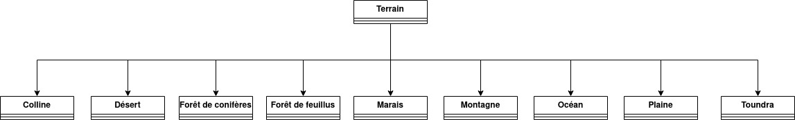

**Question :** Réaliser l'architecture que prendrait la forme d'une telle modélisation sous forme d'un diagramme UML.
Quelle serait la différence d'attributs et de méthodes entre ces classes ? Expliquer, en s'appuyant sur un exercice vu
en cours, pourquoi c'est une mauvaise idée. Quelle est la solution qu'il faudrait préférer (et que l'on va préférer) ?

**Réponse :**

Il n'y aurait pas de différences d'attributs ou de méthodes entre ces classes.